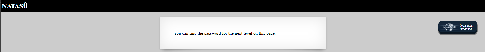
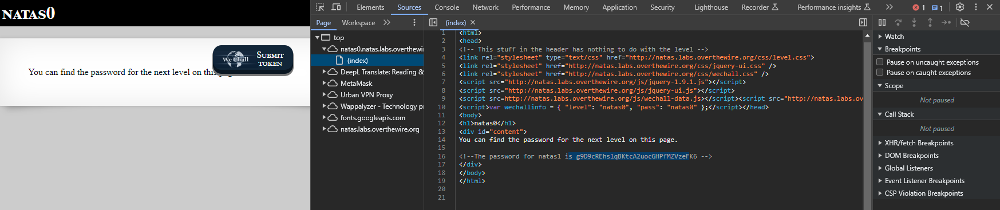
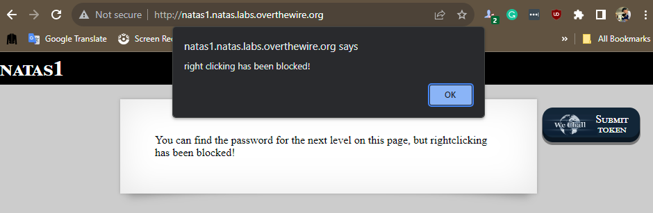
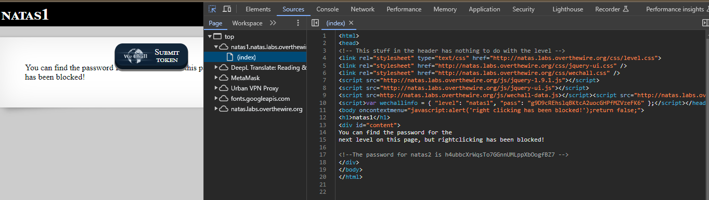

# Writeups for Over The Wire Web Exploit

> Link to the place to do the challenges: https://overthewire.org/wargames/natas/

## Natas Level 0

```
Username: natas0
Password: natas0
URL:      http://natas0.natas.labs.overthewire.org
```

Here is the clue:



So we just need to right click the mouse and inspect the page for viewing the flag:



So, the flag is:

```
g9D9cREhslqBKtcA2uocGHPfMZVzeFK6
```

## Natas Level 1

The details to login the natas 1 are:

```
Username: natas1
Password: g9D9cREhslqBKtcA2uocGHPfMZVzeFK6
URL:      http://natas1.natas.labs.overthewire.org
```

So, with the given clue, I know that the flag is in the source code but we can't inspect the page with rightclicking:



Instead of rightclicking, we can use the shortcut to inspect the source code:

```
Shift + Control + C
```

Here is the flag after I use the shortcut to inspect:



So, the flag is:

```
h4ubbcXrWqsTo7GGnnUMLppXbOogfBZ7
```
